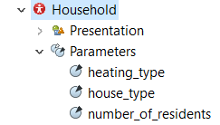

## Load a local JSON file and use it to populate an experiment

### Conditions
1. Local JSON file
2. Local AnyLogic client
3. No nested data

### Requirements

1. Reading and parsing of JSON files and Java Objects is done using [Pypeline](https://github.com/t-wolfeadam/AnyLogic-Pypeline)  
    _The source jar file is included in this folder, make sure to add this library to your pallete_


### Procedure

1. Run `create_custom_input.py` to create random data (`custom_data.json`) that describes households using a `Household` `dataclass`. Change the length of the resulting household array by changing the `number_of_households` variable, which is looped over to generate the `json` file.

> create_custom_input.py
```python
HOUSE_TYPES = ["villa", "appartment", "terraced house"]
HEATING_TYPES = ["boiler", "heatpump", "hybrid heatpump"]

@dataclass
class Household:
    house_type: str
    heating_type: str
    number_of_residents: int
```
2. Open the AnyLogic model

    On `main` the function `loadFromJson` is called on startup:  
    *The first part loads the JSON string using the `PypeLine pyCommunicator*
    ```java
   // open file in Python
   pyCommunicator.run("file = open('custom_input.json')");
   // read contents (in json form)
   rawJSON = pyCommunicator.runResults(String.class, "file.read()");
   // close the file in python
   pyCommunicator.run("file.close()");
    ```

    *The second part parses the string to List (e.g. array) of Hashmaps (key:value pairs) of types `<string>:<object>`. This is subsequently parsed to the types explicitly stated by the Household agent-type.*

    ```Java
    // use PyCommunicator helper function to convert to usable java object;
   // specify `Object` as inner type of values since they can be either 
   //		strings (for name) or double (for volatility)
   List<HashMap<String, Object>> inputData = pyCommunicator.fromJson(rawJSON, List.class);
   for (HashMap<String, Object> data : inputData) {
   	
    // To convert to correct type, use type-casting
   	String house_type = (String)data.get("house_type");
   	String heating_type = (String)data.get("heating_type");
   	int number_of_residents = (int)data.get("number_of_residents");

    // create a new Household in the households population
   	Household newHousehold = add_households(
        house_type, 
        heating_type, 
        number_of_residents
    );}
    ```
    

    1. Run the model and use the `pyCommunicator.toJson` function to print the `households` population to `JSON` using the button on the main. 
    ```java
    String json = pyCommunicator.toJson(households, true);
    traceln(json);
    ```


---
This experiment is adapted from an AnyLogic demo model found in the [cloud](https://cloud.anylogic.com/model/f7015662-9998-4d03-98de-0bb335e47a09?mode=SETTINGS&tab=GENERAL).

